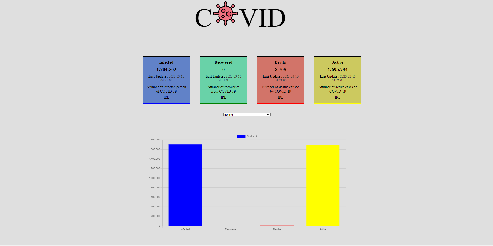

## Ödev
### - Covid-19 verilerini gösteren bir react projesi hazırlayın

## Gereksinimler

- Enfekte olan, iyileşen, ölen ve aktif hasta sayısını ekrana yerleştireceğiniz dört kart ile göstermeniz gerekiyor. Ayrıca bu kartlarda son güncellenme tarihlerini de gösterebilirsiniz.
- Başlangıçta tüm dünya genelindeki veriler gösterilmelidir.
- Kartların hemen altına yerleştireceğiniz bir dropdown içerisinde ülkeleri listelemeniz gerekiyor. Buradan seçilen herhangi ülkenin detay bilgileri görüntülenebilmelidir.
- Sayfanın altına yerleştireceğiniz bölümde ise verileri grafik olarak göstermeniz gerekiyor.
------------
**Demo için [tıklayın]()**

------------
- React 
- Redux
- ChartJS - ChartJS-2
- Axios
- ThunkMiddleware
- CSS
- [Covid API](https://covid-api.com/api/)

------------

#### Proje Ekran Alıntısı

